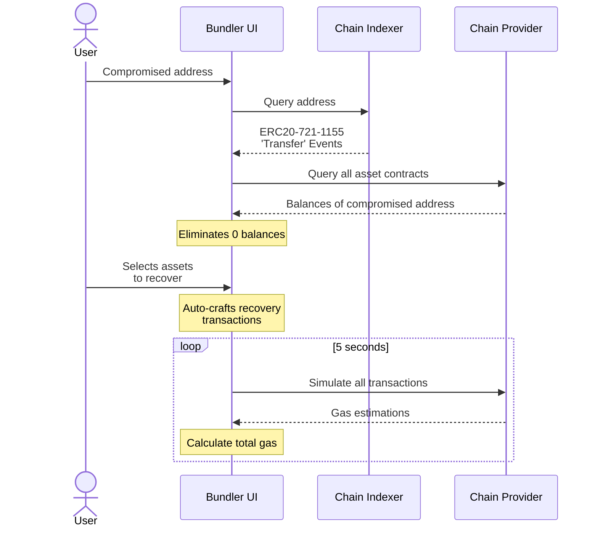
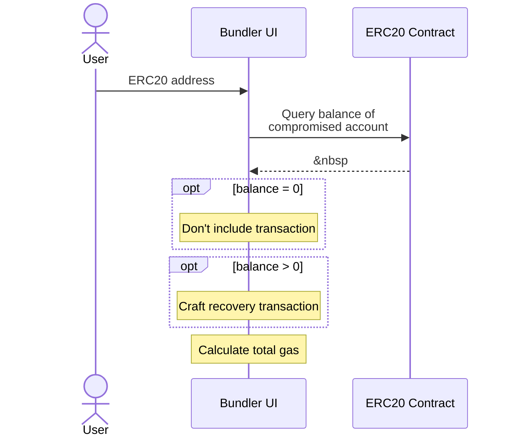
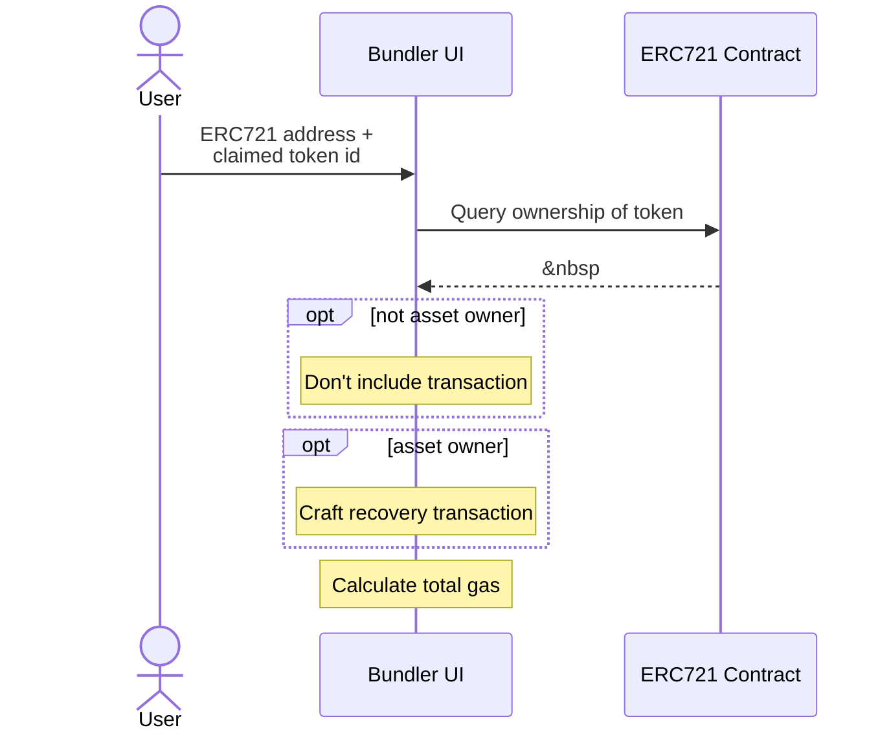
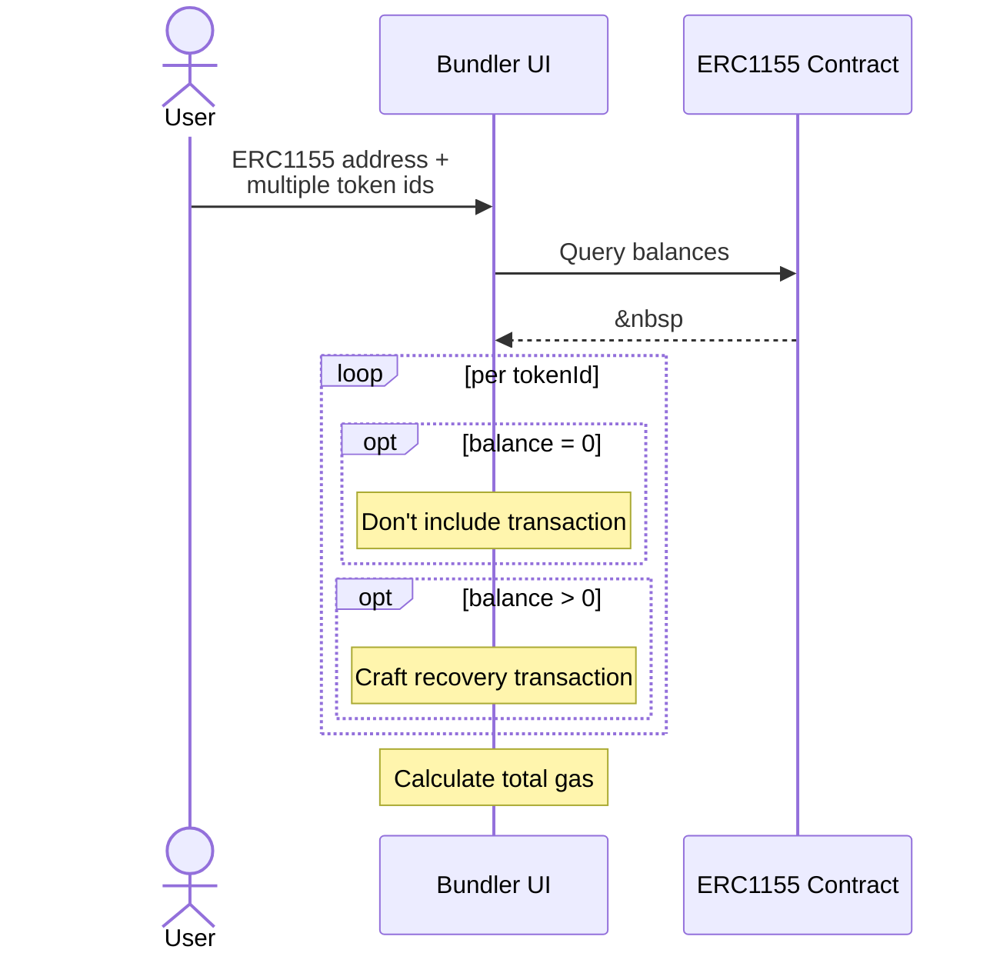
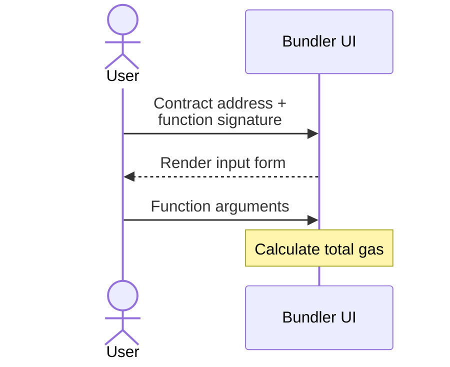
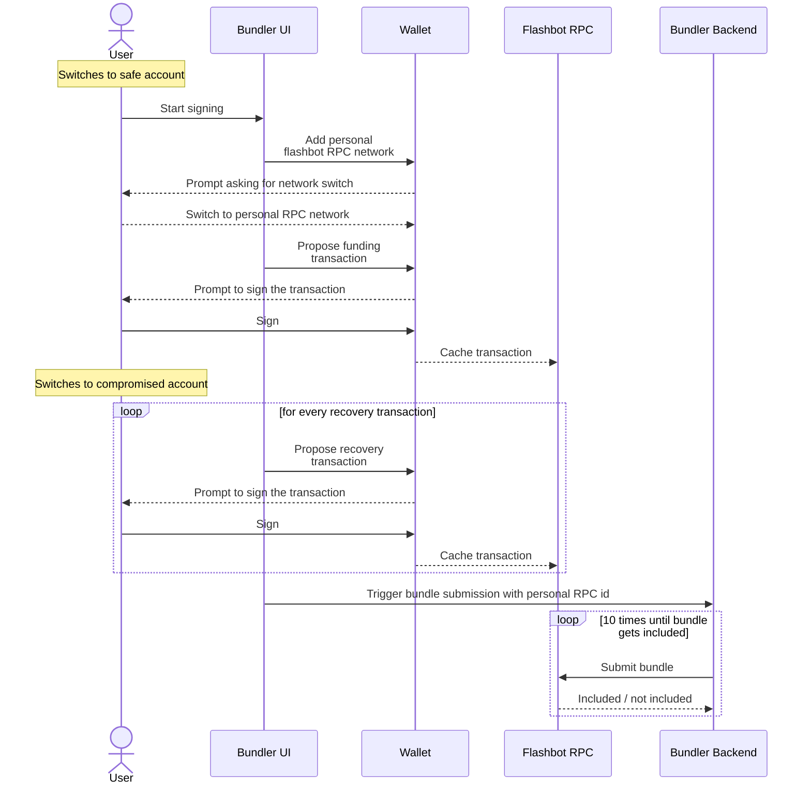
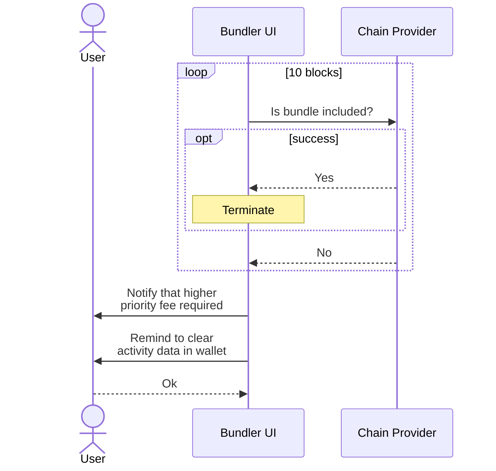

# 1- Setup phase

Refers to sequence of occurances from the moment user faces the interface to having the first ready-to-submit bundle of transactions.

 

At the end of the setup phase, user has a bundle ready to be submitted already. The gas estimation will require the transactions to be simulated, so failing transactions won't be included in this bundle. Examples include (so-claimed) ERC20 contracts that emit a Transfer event, but don't provide a 'balanceOf' function.

 

# 2- Including additional transactions

## ERC20 - ERC721 - ERC1155

Automatic asset detection only relies on Transfer events, so assets that were minted (not transferred) to the compromised account may not show up in the bundle. These assets can still be included in the recovery bundle with little effort.

 ERC20 

 ERC721 

 ERC1155 

 

## Custom calls

This bundler can also be used to send custom transactions from the compromised account, and we present a separate UI for this purpose.

 
Please remember that gas calculation will require communication with the chain provider (although not explicit here) and the crafted function call will be simulated remotely. This simulation will fail if the crafted transaction is poorly constructed. In that case, the custom transaction will not be added to the bundle.

 

# 3- Signing and submission

This phase requires a set of activities that can be confusing to a web3 beginner. The user has built their bundle of transactions, and now is the time to sign and submit them. Not only the recovery transactions will be signed by the compromised account, but also a funding transaction will be signed by the safe address.

 

The motivation behind using a back end for submissions is that [mev-relay-js](https://github.com/flashbots/mev-relay-js) does not provide CORS support, preventing access to its endpoints from a browser. Although workarounds like running a local CORS proxy exist, this bundler is built to be as beginner-friendly as possible, so it uses a small piece of serverless code for submissions.

 

# 4- Awaiting And Final Reactions

After bundle submission, the UI checks if transactions were included in a new block for 10 blocks. A success message indicates that the transactions were successful and assets are recovered. Failure is not uncommon, and bundler UI asks user to increase the priority fee for all transactions. This requires that the user signs all the transactions again.

 
Upon failure, the UI takes the user exactly to the beginning of the 3rd phase: Signing and submission. User needs to perform those steps again, and not only that, they also have to clear their activity data to flush their nonce information. This is required because otherwise, the next submission will include the failing transactions as well, so the next bundle will fail as well. Wallets don't provide an interface to do this operation on behalf of the user, so they must do it themselves.
